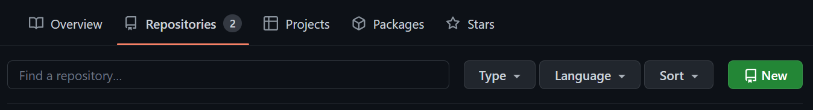
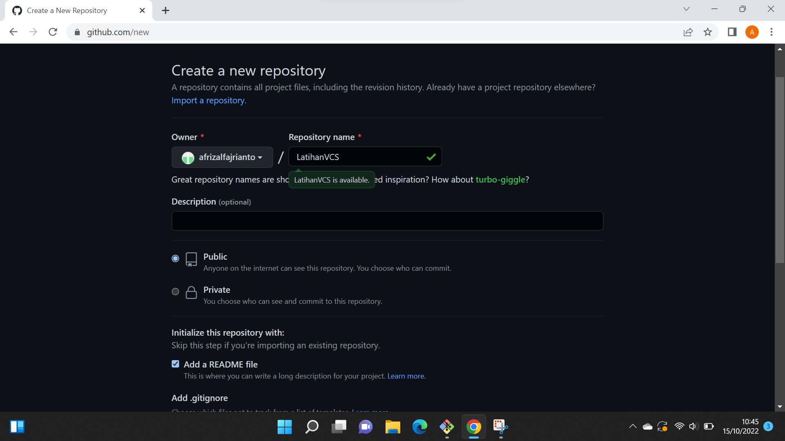
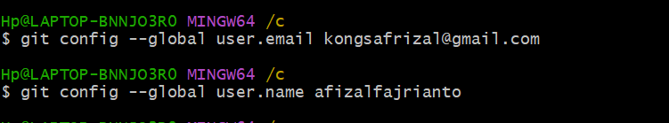
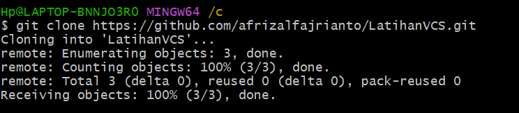

# LatihanVCS
## Langkah - langkah Penggunaan Git
### 1. Login terlebih dahulu di github.com

### 2. Setelah login buat Repository baru pada github.com

### 3. Buat Nama Repositori LatihanVCS setelah ikuti gambar yang dibawah ini

### 4. Setelah itu ke git bash untuk menghubungkan Git Bash dengan Github

### 5. Masuk ke git bash dan masuk ke direktori C

Lakukan `<git clone https://github.com/afrizalfajrianto/LatihanVCS.git>` untuk memindahkan file yang ada pada github ke direktori C>`

