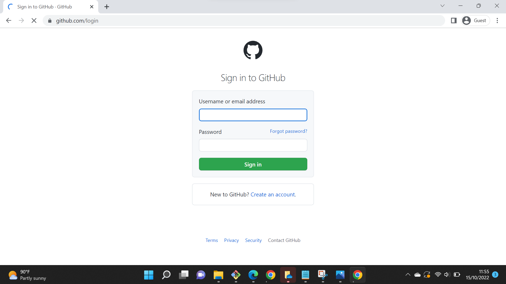

# LatihanVCS
## Langkah - langkah Penggunaan Git
### 1. Login terlebih dahulu di github.com

### 2. Setelah login buat Repository baru pada github.com

### 3. Buat Nama Repositori LatihanVCS setelah ikuti gambar yang dibawah ini

### 4. Login pada git bash

### 5. Setelah itu ke git bash untuk menghubungkan Git Bash dengan Github

### 6. Masuk ke git bash dan masuk ke direktori C

Lakukan git clone https://github.com/afrizalfajrianto/LatihanVCS.git untuk memindahkan file yang ada pada github ke direktori C
untuk mengecek https pada web dengan klik code pada repository

#### Setelah itu lakukan syntax git clone https://github.com/afrizalfajrianto/LatihanVCS.git

#### Cek direktori pada folder C di Laptop

### 7. Buka folder LatihanVCS, buka file README.md, dan edit file README.md 

### 8. Masuk ke git bash setelah itu masukan syntax cd /c/LatihanVCS

### 9. Tambahkan syntax git add README.md

### 10. Tambahkan syntax git commit "Update file"

### 11. Tambahkan syntax git push -u origin main

### 12. Cek repository pada akun github

SELESAI.

